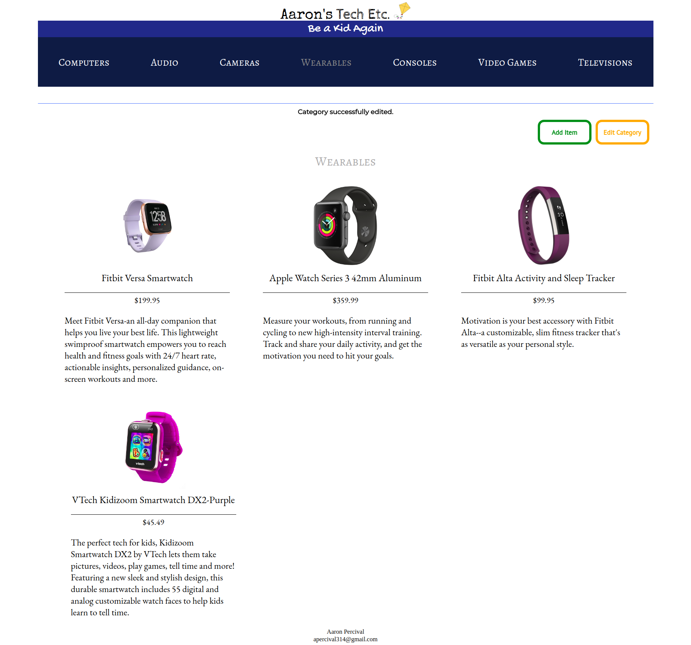

## Project Description
This project was developed for Udacity's Fullstack Developer degree program. It is an item catalog application, my own mock
representation of what a personal electronics store would have as a website. The website demonstrates CRUD operations,
OAuth 2.0 authentication, mobile responsiveness, HTML/CSS trickery, JSON endpoints, Flask, Jinja, message flashing, and more!

## Getting Started
To test and use the application, clone this github.

The project involves the following library dependencies:
* Flask
* sqlalchemy
* OAuth 2.0
* httplib2
* JSON
* requests

Upon installing any missing dependencies, cd into the project directory and run python3 backend.py in the terminal. Open a browser window, and type http://localhost:8000 into the browser's address bar. From there, the application will show itself! 

## How It Works
The item catalog has several pages and functions. The main page shows the latest items that were added to the catalog. To switch to a specific category, hover over a category name in the menu and click on it. To examine a specific item, simply hover over an item box and click on it. 

To use the administrative functions, a Google sign-in button is present on the main page of the application. Simply sign in to a gmail account to add, edit, or delete categories or items.

The application is responsive on all screen sizes (tested on Galaxy 5S, IPad, and a standard computer monitor).

## Technologies Used
* Python
* Flask
* sqlalchemy
* OAuth 2.0
* HTML/CSS
* Jinja
* Flexbox
* JSON endpoints
* Message flashing (through Flask)
* Javascript (small amount)

## Screenshots
     
<strong>Main page.</strong>

<strong>Category page in administrative mode with a recent item edit.</strong>

<strong>Add item page.</strong>

## Known Issues/Future Plans 
In the future, I would like to implement the web page onto a persistent web address, instead of having the user git clone the project. Image storage, instead of referencing a URL, would be nice also. And of course, I'm constantly figuring out how to make the item catalog look prettier.

## Attribution
The item descriptions were taken from Best Buy, Gamestop, Fry's Electronics, and Target.
